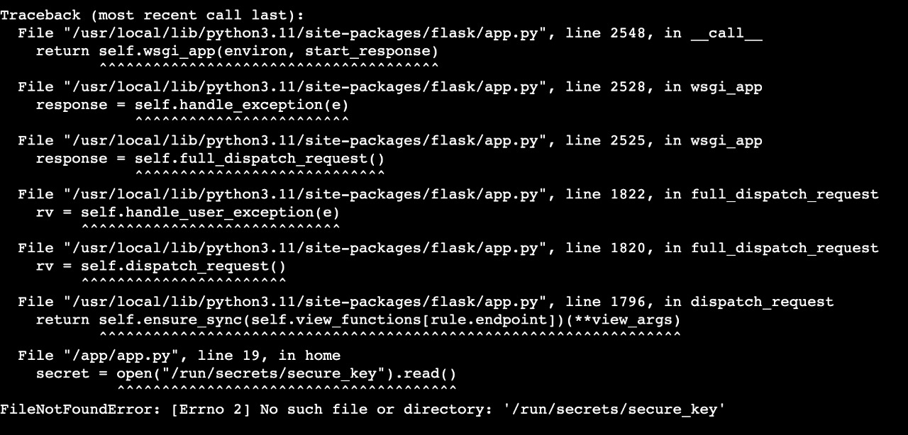

## How to manage secrets with Docker

- [The Complete Guide to Docker Secrets](https://earthly.dev/blog/docker-secrets/)
- [Manage sensitive data with Docker secrets](https://docs.docker.com/engine/swarm/secrets/)
- [Introduction to Docker Secrets](https://www.baeldung.com/ops/docker-secrets)
- [Docker Secrets - A Detailed Beginners Guide](https://www.knowledgehut.com/blog/devops/docker-secrets)
- [(Medium Paywalled)Secure Your Docker Images with Docker Secrets](https://towardsdatascience.com/secure-your-docker-images-with-docker-secrets-f2b92ec398a0)
- [Finding leaked credentials in Docker images - How to secure your Docker images](https://www.youtube.com/watch?v=SOd_XMIGRqo)

**NOTE**

Docker secrets do not get compiled into the image.

They are stored with the Docker Swarm Manager running locally.

When we run the image pulled from dockerhub in an ec2 instance, the secrets `/run/secrets/secure_key` are unavailable,
unless you add them manually to the ec2's docker swarm manager.



## Creating a secret

In swarm mode, create a sample secret:

```bash
openssl rand -base64 128 | docker secret create secure-key -
```

## Steps to Dockerize

This exercise containerizes a flask application.

### Create a Dockerfile

```bash
FROM python:3-alpine3.15  # stripped down version of python base image
# copy requirements file from current folder
COPY requirements.txt .
# install pip requirements
RUN python -m pip install -r requirements.txt

# set working directory
WORKDIR /app
# copy contents of current directory to working directory
COPY . /app

# expose PORT 5000
EXPOSE 5000

# run application
CMD python ./app.py
```

### Build Docker Image

```bash
docker build -t suriyadeepan/docker-secrets:latest .
```

### Run container

```bash
docker run --add-host=host.docker.internal:host-gateway -p 5000:5000 suriyadeepan/docker-secrets:latest
```

## Use secrets via `docker-compose`

Create a private key named `private_key.txt`.

```bash
echo "This is supposed to be a secret." > private_key.txt
```

Add the file `private_key.txt` as secret via `docker-compose.yml`

```yml
version: "3.9"

services:
  flask:
    build: ./
    ports:
      - 5000:5000
    restart: "no"
    secrets:
      - secure_key

secrets:
  secure_key:
    file: private_key.txt
```

Now the key is available through `/run/secrets/secure_key` file in the container filesystem.

```python
open("/run/secrets/secure_key").read()
```

### Notes

- `docker-compose up --build` rebuilds image every time
- Add the private key to `.dockerignore` to avoid copying it to the container
